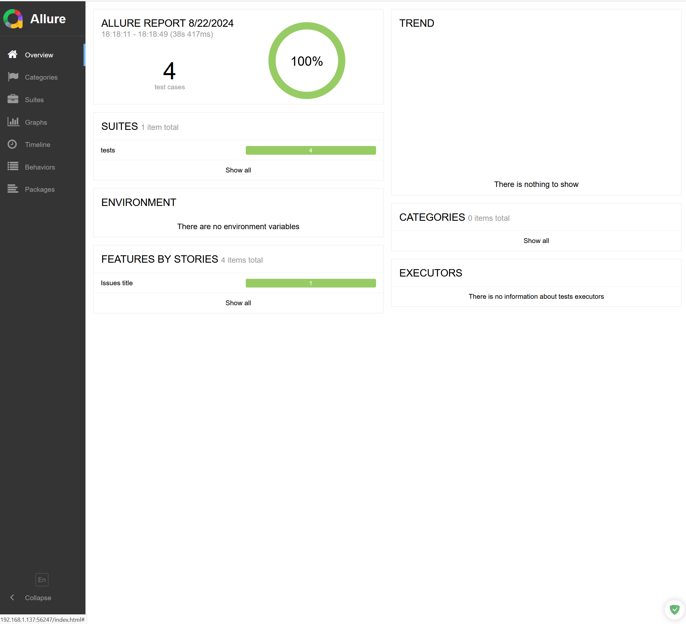
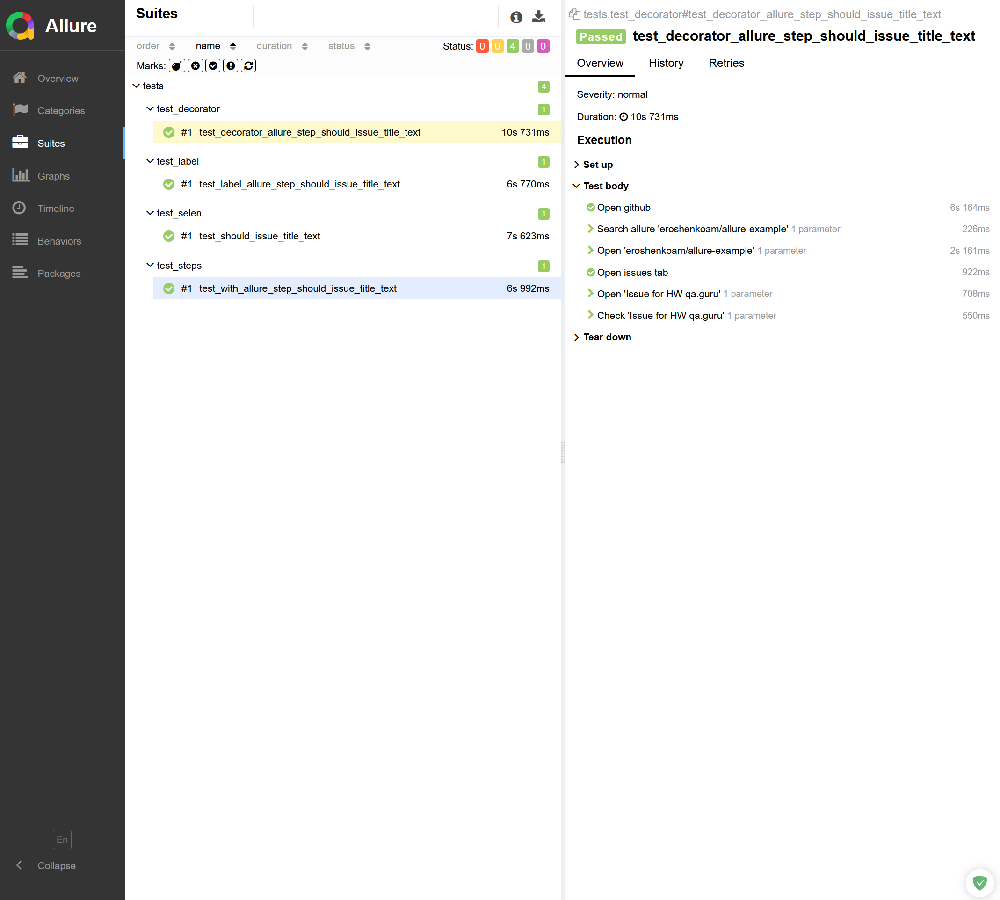

# Python Allure Reporting

## Project Description

This project demonstrates how to integrate and utilize Allure for generating detailed test reports in Python. It includes setting up Allure in a test environment, running tests, and generating reports that visually represent the test outcomes.

## Key Features

1. **Allure Integration**:
   - Setup instructions for Allure in a Python testing environment.

2. **Test Execution**:
   - Running tests with Allure to capture detailed results.

3. **Report Generation**:
   - Generating and viewing Allure reports that offer insights into test executions.

## Installation

1. Clone the repository:
   ```bash
   git clone https://github.com/iimaiorov/python-allure-reporting.git
   ```
2. Navigate to the project directory:
   ```bash
   cd python-allure-reporting
   ```
3. Install dependencies:
   ```bash
   pip install -r requirements.txt
   ```
4. Install Allure command-line tool by following the [Allure installation guide](https://docs.qameta.io/allure/#_installing_a_commandline).

## Usage

1. **Run the tests with Allure**:
   ```bash
   pytest --alluredir=allure-results
   ```
2. **Generate the Allure report**:
   ```bash
   allure serve allure-results
   ```
3. **View the report**:
   - The Allure report will open in your default browser.

## Example Reports

### Test Overview


### Detailed Test Case


## Project Structure

- **tests/**: Contains the test scripts.
